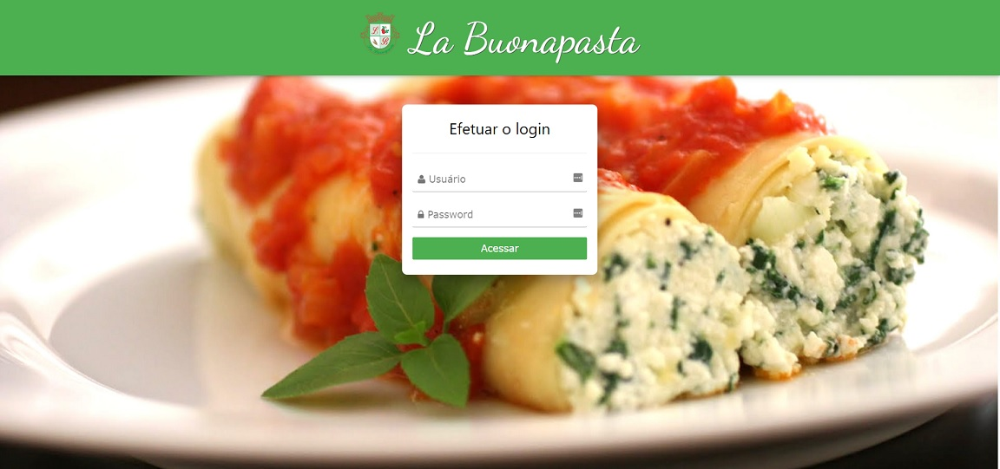
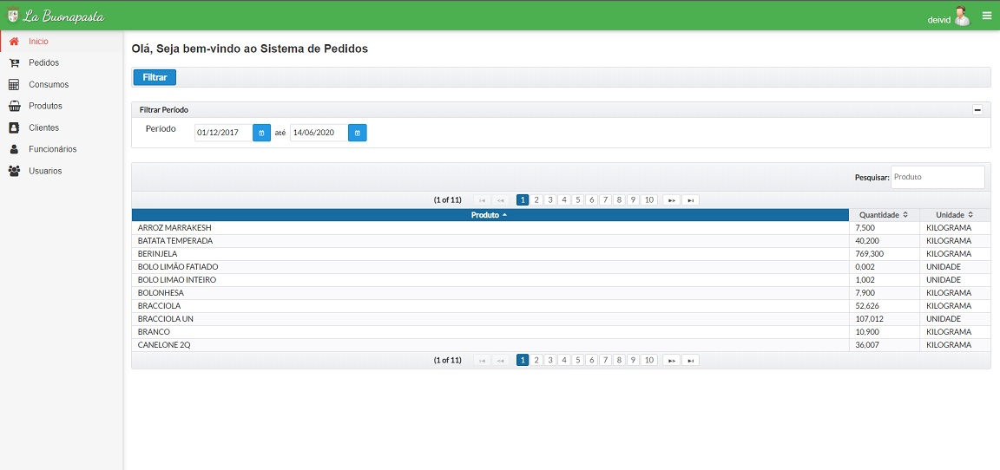
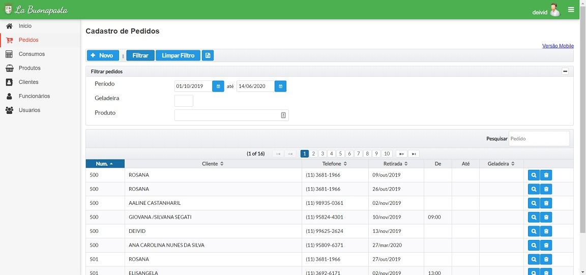
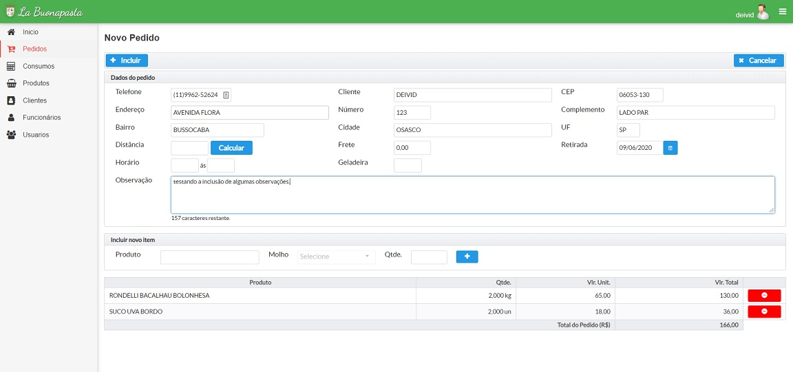
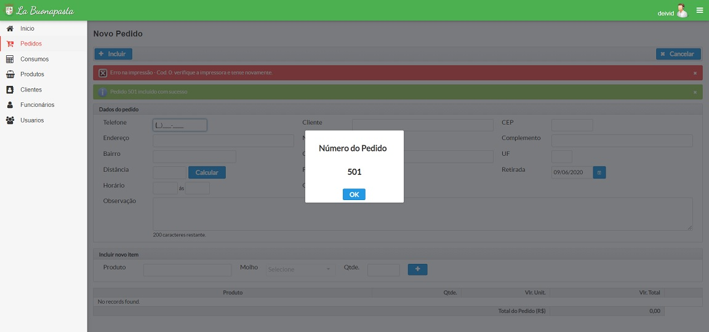

  
  <h1> Ordering Manager </h1>

Restaurant ordering manager and other functions like register of products, customer, employess, users and employee purchase.

# 📸 Screenshots

# Project structure

This is a fullstack project developed with the technologies below.

## 🛠️ Technologies

These are the technologies used throughout the project:

- [Java][java]
- [JSF][jsf]
- [PrimeFaces][primefaces]
- [MySql][mysql]
- [Google Distance Matrix API][apimatrix] - API for calculating the distance from location of customer
- [Via CEP][viacep ] - API for consulting CEP

# 📝 License

This project is under the MIT license. See the [LICENSE](LICENSE) for more information.

---

For more about [me:crown:](https://www.linkedin.com/in/deivid-assump%C3%A7%C3%A3o-rodrigues-a36a5685/).

[java]: https://www.java.com/pt_BR/
[jsf]: https://pt.wikipedia.org/wiki/JavaServer_Faces
[primefaces]: https://www.primefaces.org/showcase/
[mysql]: https://www.mysql.com/
[apimatrix]: https://developers.google.com/maps/documentation/distance-matrix/start
[viacep]: https://viacep.com.br/
